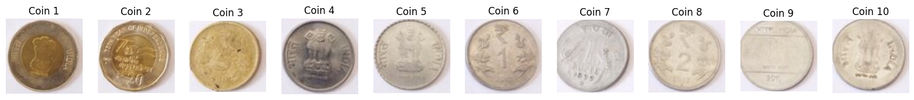

# VR_Assignment1_Shiven_Phogat_IMT2022050

## Introduction

This assignment has 2 parts. You can find the code for each part in separate directories. Each directory has input images that must be present in your system at time of running .

## Prerequisites

Before running the code, ensure you have the following installed:

- **Python 3.10**
- **NumPy**
- **OpenCV (cv2)**
- **Matplotlib**

## Installation
1. **Clone this repository**:
   ```sh
   git clone https://github.com/sassy2711/VR_Assignment1_ShashwatChaturvedi_IMT2022118.git
   cd VR_Assignment1_ShashwatChaturvedi_IMT2022118.git
   ```
## How to Run
Go to the respective folder for each part and execute the corresponding script 

Coins segmentation script - execute the cells in coins.ipynb.
Panorama stiching script - execute the cells in panorama_stitch.ipynb

please note you will have to change the file paths manually for each image 

## Methods Chosen

### Coin Detection:-

#### A
- **CLAHE (Contrast Limited Adaptive Histogram Equalization)** : Enhances local contrast to improve visibility of coin edges.
- **Gaussian Blur** : Smoothens the image to reduce noise and small details.
- **Adaptive Thresholding** : Converts the image to a binary format dynamically based on local pixel intensities.
- **Morphological Closing** : Fills small gaps in thresholded areas to ensure complete coin shapes.
- **Canny Edge Detection** : Detects strong edges in the image.
- **Find Contours** : Extracts the boundaries of detected coin shapes.
- **Draw Contours** : Overlays detected coin outlines on the original image.

#### B
- **CLAHE** : Enhances image contrast to highlight features.
- **Stronger Gaussian Blur** – Further suppresses noise and texture details.
- **Otsu’s Thresholding** – Automatically determines the best threshold to binarize the image.
- **Morphological Closing** – Removes small noise and helps merge coin regions.
- **Dilation (Sure Background)** – Expands the detected objects to create a better foreground mask.
- **Connected Components** – Labels different regions for segmentation.
- **Watershed Algorithm** – Segments overlapping coins by detecting boundaries.
- **Find & Filter Contours** – Extracts only significant coin-shaped regions.
- **Extract Coins** – Crops and isolates individual coins from the original image.

#### C
- **CLAHE** – Improves local contrast to enhance segmentation.
- **Stronger Gaussian Blur** – Reduces unwanted textures and small details.
- **Otsu’s Thresholding** – Converts grayscale image into binary format automatically.
- **Morphological Closing** – Eliminates noise and ensures better contour detection.
- **Find & Filter Contours** – Identifies and removes small unwanted areas.
- **Count Coins** – Calculates the total number of detected coin-like objects.
- **Draw Contours** – Highlights detected coins on the original image for visualization.

### Panorama Stiching:-
- **SIFT (Scale-Invariant Feature Transform)** – Detects and computes keypoints and descriptors for feature matching.
- **cv2.drawKeypoints** – Visualizes detected keypoints on images for analysis.
- **BFMatcher (Brute-Force Matcher)** – Matches feature descriptors between images using L2 norm.
- **cv2.findHomography (RANSAC)** – Computes a transformation matrix to align images based on matched points.
- **cv2.warpPerspective** – Warps an image using the computed homography matrix for alignment.
- **cv2.findContours & cv2.boundingRect** – Finds and crops the stitched image to remove black borders.
- **cv2.imread & cv2.imwrite** – Reads input images and saves the final stitched panorama.
- **Matplotlib (plt.imshow, plt.show)** – Displays images with keypoints and the final stitched panorama.

## Results

### Coin detection:-



### Panorama Stiching:-


## Observations
- **[1]**: A few of the inscribings in the coins were also detected as edges.
- **[2]**: A slight seam is visible in the stitched panorama. It may be due to misalignment, exposure differences, poor blending, or lens artifacts like vignetting.

## License
This project is licensed under the **[MIT License](LICENSE)**.


